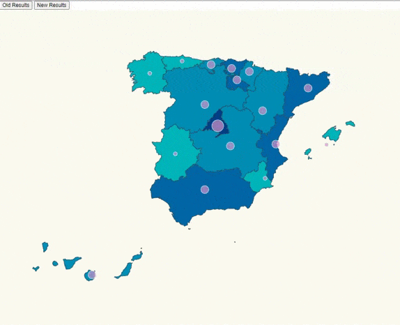

# 02-Interactive-Covid-Map

We want something like this:




We have to face two challenges here:

- Place color background on a map based on affected cases.
- Scale color background  on affected number.

# Steps

- We will take as starting the last exercise, let's copy the content from that folder and execute _npm install_.

```bash
npm install
```
- Let's assign a range of colores for that domain:

_./src/index.ts_

```diff
+ const color = d3
+  .scaleThreshold<number, string>()
+  .domain([0,10,20,100,1000,2000,5000,10000,15000])
+  .range([
+  "#D1EAEF",
+  "#00B4BA",
+  "#008EB4",
+  "#0066A5",
+  "#003E89",
+  "#09115E",
+  "#10153E"
+ ]);
```

- Let's create a help function to map from community to color: we have to take into account that some Spanish communities are not affected

_./src/index.ts_

```diff
+ const assigncommunityBackgroundColor = (data :ResultEntry[],comunidad: string) => {
+    const item = data.find(
+      item => item.name === comunidad
+    );
+    return item ? color(item.value) : color(0);
+ };
```

- And add a fill style to match community name with corresponding background color (based on coronavirus affected people):

_./src/index.ts_

```diff
svg
  .selectAll("path")
  .data(geojson["features"])
  .enter()
  .append("path")
  .attr("class", "country")
+  .style("fill", function(d: any) {
+        return assigncommunityBackgroundColor(stats,d.properties.NAME_1);
+      })
  // data loaded from json file
  .attr("d", geoPath as any);
```

- Let's change the projection we are using (we will need to tweak as well the
  _scale_ and _translate_ values):

_./src/index.ts_

```diff
const aProjection =
-   d3
-  .geoMercator()
+  d3Composite
+  .geoConicConformalSpain()
  // Let's make the map bigger to fit in our resolution
-  .scale(2000)
+  .scale(3300)
  // Let's center the map
-  .translate([600, 2000]);
+  .translate([500, 400]);
```

- In our updateMap function let´s add this to update the color background too. 

```diff
+const updateMap = (data: ResultEntry[]) => {

+    d3
+    .selectAll("path")
+    .data(geojson["features"])
+    .attr("class", "country")
+    .transition()
+    .duration(1500)
+    .style("fill", function(d: any) {
+        return assigncommunityBackgroundColor(data,d.properties.NAME_1);
+      })
+     // data loaded from json file
+    .attr("d", geoPath as any);
    
    d3 .selectAll("circle")
    .data(latLongCommunities)
    .attr("class", "affected-marker")
    .attr("r", (d) => calculateRadiusBasedOnAffectedCases(data,d.name))
    .transition()
    .duration(2000)
    .attr("cx", (d) => aProjection([d.long, d.lat])[0])
    .attr("cy", (d) => aProjection([d.long, d.lat])[1]);   
  };
```


- We have to be careful because the community names are different in the different data files, so let´s check them and fix it.(We have to look at the name that comes in spain.json) 

_./src/communities.ts_
_./src/stats.ts

- This is an example of change in communities.ts 

```typescript
export const latLongCommunities = [
  {
+    name: "Comunidad de Madrid",
    long: -3.70256,
    lat: 40.4165,
  },
  {
    name: "Andalucía",
    long: -4.5,
    lat: 37.6,
  },
  {
+    name: "Comunidad Valenciana",
    long: -0.37739,
    lat: 39.45975,
  },
  {
+    name: "Región de Murcia",
    long: -1.13004,
    lat: 37.98704,
  },
  {
    name: "Extremadura",
    long: -6.16667,
    lat: 39.16667,
  },
  {
    name: "Cataluña",
    long: 1.86768,
    lat: 41.82046,
  },
  {
    name: "País Vasco",
    long: -2.75,
    lat: 43.0,
  },
  {
    name: "Cantabria",
    long: -4.03333,
    lat: 43.2,
  },
  {
+    name: "Principado de Asturias",
    long: -5.86112,
    lat: 43.36662,
  },
  {
    name: "Galicia",
    long: -7.86621,
    lat: 42.75508,
  },
  {
    name: "Aragón",
    long: -1.0,
    lat: 41.0,
  },
  {
    name: "Castilla y León",
    long: -4.45,
    lat: 41.383333,
  },
  {
+    name: "Castilla-La Mancha",
    long: -3.000033,
    lat: 39.500011,
  },
  {
    name: "Islas Canarias",
    long: -15.5,
    lat: 28.0,
  },
  {
    name: "Islas Baleares",
    long: 2.52136,
    lat: 39.18969,
  },
  {
+    name: "Comunidad Foral de Navarra",
    long: -1.65,
    lat: 42.816666,
  },
  {
    name: "La Rioja",
    long: -2.445556,
    lat: 42.465,
  },
];
```

- Let's import it:

_./src/index.ts_

```diff
import * as d3 from "d3";
import * as topojson from "topojson-client";
+ import { latLongCommunities } from "./communities";
```

- If we run the example we can check that know circles are shown in the right size and the autonomous community with a specific background color that indicates the severity of the cases

-Let´s change the circle color too

_./src/map.css_

```diff
.country {
  stroke-width: 1;
  stroke: #2f4858;
  fill: #008c86;
}

.affected-marker {
    stroke-width: 1;
  + stroke: #C6FCED;
  + fill: #D495CC;
   fill-opacity: 0.7;
}
```

- Let's apply this style to the black circles that we are rendering:

_./src/index.ts_

```diff
svg
  .selectAll("circle")
  .data(latLongCommunities)
  .enter()
  .append("circle")
+  .attr("class", "affected-marker")
  .attr("r", d => calculateRadiusBasedOnAffectedCases(d.name))
  .attr("cx", d => aProjection([d.long, d.lat])[0])
  .attr("cy", d => aProjection([d.long, d.lat])[1]);
```


## Author: Álvaro Martín Jiménez
